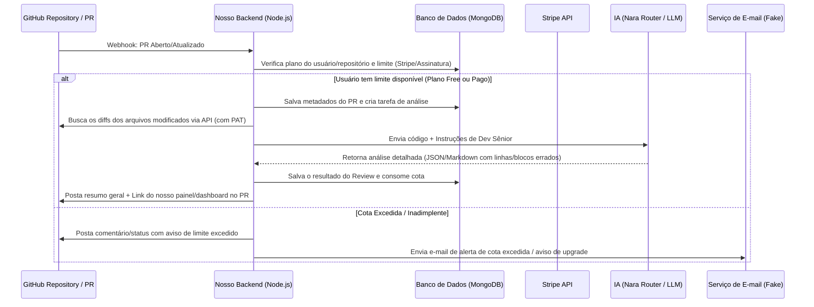

# Planejamento do Backend: Code Review IA (Senior Developer)

Este documento serve como base para o brainstorming e planejamento da arquitetura e das funcionalidades do backend da aplicação de revisão de código automatizada via IA.

---

## Fluxo de Funcionamento Proposto

O objetivo principal da aplicação é interceptar ou buscar código do GitHub (especialmente Pull Requests) e enviar para uma API de IA configurada com um prompt de desenvolvedor sênior para gerar revisões construtivas e precisas.

---

## Decisões Arquiteturais & Opções de Tecnologias

### 1. Core Stack

- **Linguagem:** TypeScript (essencial para segurança de tipos e manutenibilidade).
- **Framework HTTP:** **Express**. Simples, clássico, com ampla comunidade e compatibilidade perfeita com SDKs de terceiros (Stripe, Mongoose).

### 2. Integração com GitHub

- **Abordagem de Captura:** **Webhooks do GitHub** para processar eventos de `pull_request` (aberto, sincronizado, reaberto).
- **Autenticação:** **Personal Access Tokens (PAT)** configurados no backend, simplificando as permissões e o acesso à API do GitHub sem a complexidade de um GitHub App nesta fase inicial.
- **Biblioteca de Integração:** `@octokit/rest` (cliente oficial do GitHub) e `@octokit/webhooks` para validação de assinatura dos payloads e interações (leitura de diffs e postagem de comentários).

### 3. Banco de Dados e Modelagem (Não Relacional)

- **Banco de Dados:** **MongoDB** (banco de dados NoSQL ideal para armazenar documentos com estruturas dinâmicas, como metadados do GitHub e históricos de reviews).
- **ODM (Object Document Mapper):** **Mongoose** (para prover schema validation, tipagem forte via TypeScript e facilidade na escrita de queries).

### 4. Planos & Monetização (Integração com Stripe)

- **Níveis de Assinatura:**
  - **Plano Gratuito (Free Tier):** Cota limitada de reviews por mês (ex: 5 reviews/mês) em repositórios públicos.
  - **Plano Pago (Pro/Premium Tier):** Reviews ilimitados ou cota muito maior, suporte a repositórios privados e maior prioridade de processamento.
- **Integração com Stripe:**
  - **Stripe Checkout & Billing Portal:** Fluxo simplificado para contratação e gerenciamento de assinaturas pelos usuários.
  - **Webhooks do Stripe:** Endpoint dedicado no Express (ex: `/api/webhooks/stripe`) para receber eventos em tempo real (`customer.subscription.created`, `customer.subscription.deleted`, etc.) e atualizar o plano do usuário no MongoDB.

### 5. Integração com a IA (Foco em Otimização, Contexto e Skills)

- **Modelos Utilizados (via Nara Router API):**
  - **Modelos de Baixa Latência (ex: GPT-4o-mini / Gemini Flash via Nara Router):** Utilizados para reviews cotidianos e rápidos pelo seu baixíssimo tempo de resposta e custo de tokens reduzido.
  - **Modelos de Raciocínio Complexo (ex: Claude 3.5 Sonnet / GPT-4o via Nara Router):** Opcionais (ativados via planos ou para arquivos críticos) para refatorações complexas que abrangem múltiplos arquivos ou códigos muito extensos.

- **1. Estratégias de Otimização (Eficiência de Custos e Performance):**
  - **Filtro Inteligente de Arquivos (Diff Filtering):** Antes de enviar o código, o backend filtra e remove arquivos irrelevantes como arquivos de lock (`package-lock.json`, `yarn.lock`), assets de imagens, builds compilados e outros arquivos binários.
  - **Saída Estruturada com JSON Schema:** Configuração dos modelos através do Nara Router para retornar a revisão estritamente em formato estruturado (definindo chaves como `file`, `line`, `severity`, `message`, `suggestion`), eliminando falhas de parser sintático no backend e economizando tokens de formatação.
  - **Context Caching (quando suportado):** Para repositórios com regras internas extensas ou especificações da arquitetura do projeto, utilizaremos o cache de contexto (nos modelos compatíveis via Nara Router) para reduzir significativamente o custo e tempo de processamento de chamadas recorrentes.

- **2. Gerenciamento de Contexto (Context Strategy):**
  - **Aproveitamento da Janela de Contexto:** Utilizar a ampla capacidade de janela de contexto dos modelos fornecidos pela API do Nara Router para enviar o arquivo modificado completo (e não apenas as linhas soltas do diff), permitindo que a IA compreenda o contexto global do código modificado, imports, assinaturas de funções e lógica interna.
  - **Metadados Adicionais:** Fornecer à IA informações contextuais básicas sobre a stack tecnológica declarada no projeto (ex: frameworks utilizados, versões) e a descrição escrita do PR.
  - **System Instructions:** Separação do comportamento esperado do revisor ("Senior Developer persona") usando as `systemInstruction` (ou similar) da API, mantendo as diretivas estáticas separadas do payload dinâmico do PR.

- **3. Definição de Skills (Habilidades da IA):**
  As instruções de sistema moldarão a IA para focar em skills específicas durante o review:
  - **Segurança (OWASP):** Varredura para detecção de injeções (SQL, NoSQL), segredos expostos diretamente no código, má manipulação de dados sensíveis e vulnerabilidades comuns.
  - **Performance & Eficiência:** Identificação de queries de banco ineficientes, falta de paginação, loops síncronos que podem travar o event loop do Node e alocações de memória desnecessárias.
  - **Clean Code & Boas Práticas:** Avaliar legibilidade, complexidade ciclomática elevada, nomenclatura confusa, acoplamento e obediência a princípios SOLID.
  - **Testabilidade:** Identificar trechos de lógica complexos e sugerir especificações ou mocks para a criação de novos testes unitários.

### 6. Envio de E-mails (Notificações)

- **Serviço de E-mail (Abstração):**
  - Implementação de um serviço de envio de e-mails desacoplado usando um padrão de interface (`EmailProvider`) para facilitar a troca do provedor de e-mail no futuro.
  - Na fase inicial/desenvolvimento, utilizaremos um **Fake Email Service** (por exemplo, um provedor que apenas exibe logs estruturados no console ou faz uso do `nodemailer` integrado ao **Ethereal Email** ou **Mailtrap**).
  - Posteriormente, este provedor fake poderá ser substituído por um serviço robusto de produção (como SendGrid, Resend ou Amazon SES) apenas alterando as variáveis de ambiente e a classe correspondente.
- **Principais Gatilhos de E-mail:**
  - **Boas-vindas & Instruções de Configuração:** Enviado no primeiro acesso ou criação de conta do usuário.
  - **Cota Excedida:** Alerta quando o usuário atinge o limite do plano contratado e tenta rodar novos reviews de PRs.
  - **Notificações do Stripe (Faturamento):** Falhas de pagamento na assinatura, renovações, cancelamentos ou alertas de expiração de cartão.

### 7. Resiliência, Segurança & Limites de Borda

- **Deduplicação e Idempotência de Webhooks:**
  - **Identificadores Únicos:** Armazenar no MongoDB os cabeçalhos/identificadores de entrega exclusivos das requisições recebidas (`X-GitHub-Delivery` do GitHub e o `id` do evento no Stripe) em uma coleção de controle de idempotência (`processed_events`).
  - **Fluxo:** Ao receber qualquer webhook, antes de computar ou debitar cotas, o backend consulta se o identificador já existe no banco. Se existir, responde imediatamente com `200 OK` (sem reprocessar nem consumir cotas novamente).
- **Tratamento de Diffs Volumosos (Monorepos & PRs Gigantes):**
  - **Filtro e Limites:** Definir um limite máximo aceitável para o tamanho do diff textual (ex: 200KB ou aprox. 50 mil tokens).
  - **Estratégia de Fallback:**
    - Exclusão de arquivos de configuração, build e locks (já contemplado).
    - Priorização inteligente: Se o PR exceder o limite, o sistema ordenará os arquivos por criticidade (ex: arquivos de lógica de negócio `.ts`, `.js`, `.py` primeiro; documentação `.md` e testes por último) e revisará apenas o subconjunto que cabe no limite.
    - Notificação no PR: O bot do GitHub postará um aviso explicando que, devido ao tamanho do PR, apenas os arquivos mais críticos foram analisados, sugerindo ao desenvolvedor realizar Pull Requests menores e mais focados.
- **Segurança de Credenciais e PATs (Criptografia em Repouso):**
  - **Criptografia Simétrica (AES-256-GCM):** Os Personal Access Tokens (PATs) fornecidos pelos usuários do plano corporativo/pago para leitura de repositórios privados não serão salvos em texto puro no MongoDB. Eles serão criptografados em repouso usando o algoritmo `aes-256-gcm`.
  - **Gestão de Chaves:** A chave de criptografia master do backend será injetada estritamente via variável de ambiente secreta (`ENCRYPTION_KEY`), com rotação periódica.

---

## Decisões de Brainstorming Consolidadas

1. **Exibição do Review:** O review será exibido em um **painel/dashboard web próprio** do sistema. No GitHub (PR), postaremos apenas um comentário com um resumo geral e o link direcionando para o nosso painel/dashboard.
2. **Autenticação com o GitHub:** Usaremos **Personal Access Tokens (PAT)** nesta primeira etapa para simplificar o desenvolvimento, configuração de credenciais e acesso aos repositórios.
3. **Escopo do Feedback da IA:** Faremos uma **análise geral do PR**, mas com a instrução específica de **apontar exatamente qual linha ou bloco de código contém erros ou melhorias** (usando a linha/bloco extraído do diff do PR).
4. **Fila de Processamento (Concorrência):** Usaremos uma **fila simples em memória** (com bibliotecas como `p-limit` ou similar) integrada diretamente no Express para controlar a taxa de requisições enviadas ao Nara Router, respeitando os limites de taxa (rate limits) do roteador e evitando a necessidade inicial de Redis/BullMQ.
5. **Serviço de E-mail Fake/Substituível:** O envio de e-mails para suporte a eventos de cota e pagamento utilizará uma abstração de envio fake no início do projeto para não depender de chaves de API e contas de serviços de e-mail pagos.
6. **Deduplicação por ID de Entrega:** Todo webhook recebido (GitHub/Stripe) terá seu ID único registrado no banco para evitar processamento duplicado acidental por conta de retentativas automáticas (retry).
7. **Criptografia Mandatória de PATs:** Qualquer token de acesso de usuário persistido no banco de dados para ler repositórios privados será criptografado em repouso com algoritmo forte (AES-256-GCM).
8. **Limite de Borda para Diffs:** Para evitar custos excessivos com a API do Nara Router e tempos de resposta longos, PRs gigantes serão truncados/filtrados de forma inteligente para focar em arquivos de código principais.

---

## Alternativas Estudadas & Trade-offs (Resumo)

- **Framework:** Express (escolhido por facilidade/Stripe) vs. *Fastify* / *NestJS*.
- **Banco/ORM:** MongoDB & Mongoose (escolhido por flexibilidade dos diffs/reviews) vs. *Postgres* & *Prisma* / *Drizzle*.
- **GitHub Auth:** Personal Access Tokens - PAT (escolhido para MVP célere) vs. *GitHub App* (ideal a longo prazo).
- **Interface:** Dashboard Web Próprio (escolhido para histórico/Stripe/gráficos) vs. *Comentários Diretos no PR*.
- **Fila/Fila:** Em memória com `p-limit` (escolhido para MVP de baixo custo) vs. *Redis* & *BullMQ* (ideal para escala).

---

## Próximos Passos Propostos

1. **Estruturação do projeto backend:**
   - Inicialização com TypeScript, Express e Mongoose (MongoDB).
   - Configuração de logger estruturado (ex: `pino` ou `winston`) acoplado com Correlation IDs para rastreamento de logs ponta a ponta.
   - Configuração do linter e do parser de webhook do GitHub.
2. **Módulo de Planos e Pagamentos (Stripe) & Idempotência:**
   - Configuração do SDK do Stripe e criação de rotas para Checkout Session e Webhooks.
   - Modelagem do schema de Usuário/Assinatura no MongoDB.
   - Implementação de tabela/coleção de controle de idempotência (`processed_events`) para evitar processamento de webhooks duplicados.
3. **Criação do módulo do GitHub Service & Criptografia:**
   - Implementação de utilitários de criptografia (AES-256-GCM) para armazenar os PATs com segurança no MongoDB.
   - Autenticação via Personal Access Token (PAT) e leitura de arquivos alterados (diffs).
   - Implementação da lógica de limite de tamanho de diff e fallbacks (truncamento inteligente de arquivos).
4. **Criação do módulo de IA (Nara Router Service) & Testes de Qualidade:**
   - Configuração do prompt de Dev Sênior e parser de respostas estruturadas (foco em apontar linhas/blocos incorretos).
   - Desenvolvimento de suíte de testes com **Golden Dataset** (repositório de PRs de teste estáticos com falhas pré-configuradas) para avaliar a consistência e qualidade do prompt e evitar regressões.
5. **Painel Web (Dashboard de Visualização & Estados de Progresso):**
   - Criação de estados detalhados da análise no banco (`PENDENTE`, `PROCESSANDO`, `FINALIZADO`, `FALHOU`) e rotas que permitam à interface web exibir o progresso do processamento em tempo real para o usuário.
6. **Módulo de Notificações por E-mail (Serviço Fake):**
   - Definição do contrato da classe/serviço de e-mail (`EmailProvider`).
   - Criação do provedor fake (`ConsoleEmailProvider` ou similar) e configuração de templates HTML para alertas de cota e mensagens transacionais.
   - Integração do envio no fluxo de webhooks e limites.
7. **Integração de ponta a ponta & Observabilidade:**
   - Receber webhook -> verificar idempotência -> colocar na fila simples -> verificar assinatura/limites -> atualizar status para PROCESSANDO -> processar diffs -> chamar Nara Router -> se falhar/timeout, registrar nos logs e atualizar status para FALHOU -> salvar no MongoDB -> postar resumo e link no GitHub -> enviar notificações/e-mails quando aplicável -> descontar cota.
